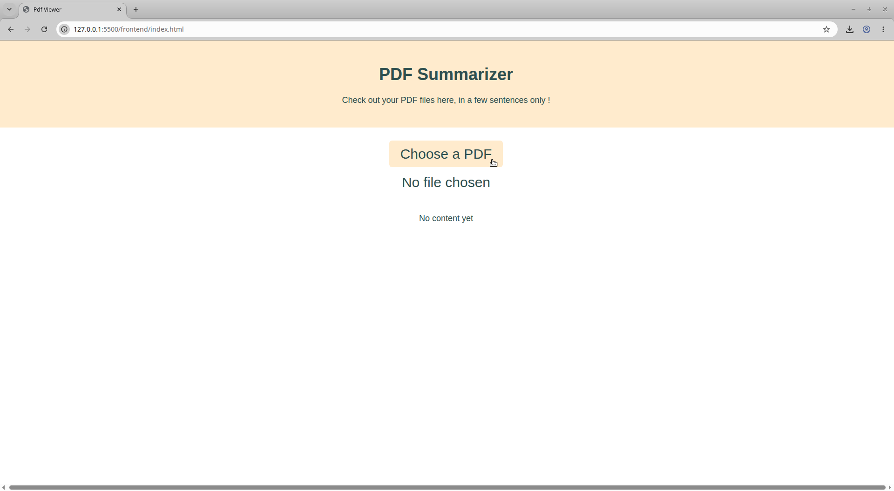
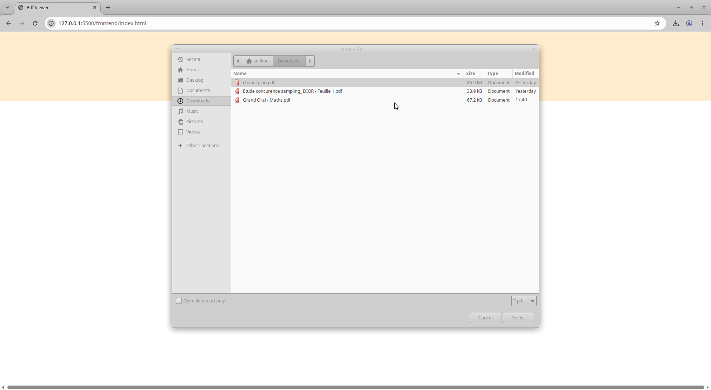
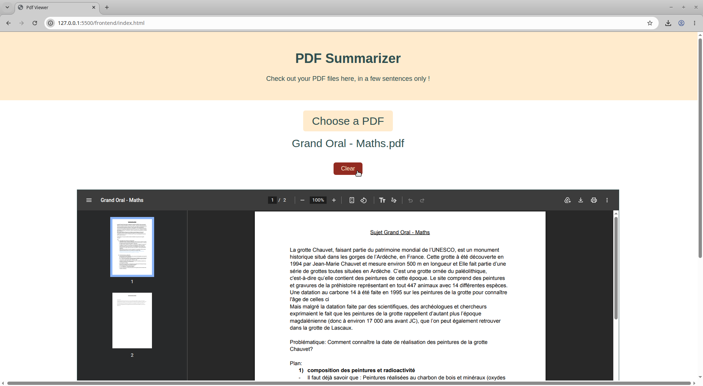
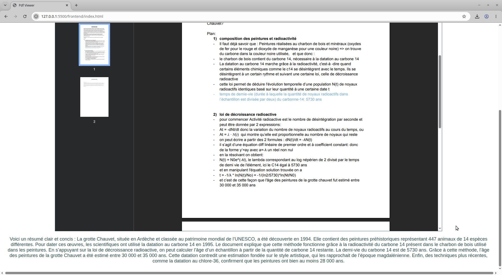

# PDF viewer and AI summarizing

A web app that lets you upload a PDF, view it in the browser and get an AI generated summary of its contents.

# Demo

# Features 

- Upload and preview PDFs directly in the browser
- Extracts text from the PDF using PDF.js
- Generates an AI summary of the document via OpenAI's API
- Clear button to reset and upload a new file
- Error handling for failed uploads or API issues

# Tech Stack

**Frontend:** HTML, CSS, JavaScript, PDF.js
**Backend:** Node.js, Express
**AI:** OpenAI API

# How it works

1. User selects a PDF in the browser
2. The PDF is rendered locally using an iframe
3. PDF.js extracts the raw text from the file
4. The extracted text is sent to a Node/Express backend
5. The backend forwards the text to OpenAI's API with a summarization prompt
6. The summary is returned to the frontend and displayed below the PDF

-- The API key is never exposed to the browser as all AI calls happen server-side --

# If you want to test it

1) Clone the repo
2) Install backend dependencies (In /backend with npm)
3) Add OpenAI api key inside .env in /backend
4) Start the backend (bash : **npm run dev**, server runs on \`http://localhost:3000\`)
5) Open frontend/index.html with Live Server (the VS Code extension) or any other local static server

# Possible Improvements

- Deploy frontend and backend so it's usable without local setup
- Support multiple file uploads
- Size limit for PDFs
- Add page navigation for multi page PDFs
- Loading spinner while the summary is generating
- Summarize button instead of automatic summary once pdf has been loaded

